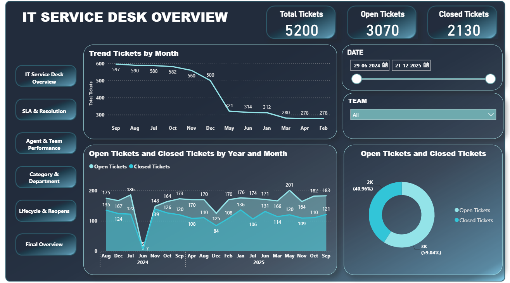
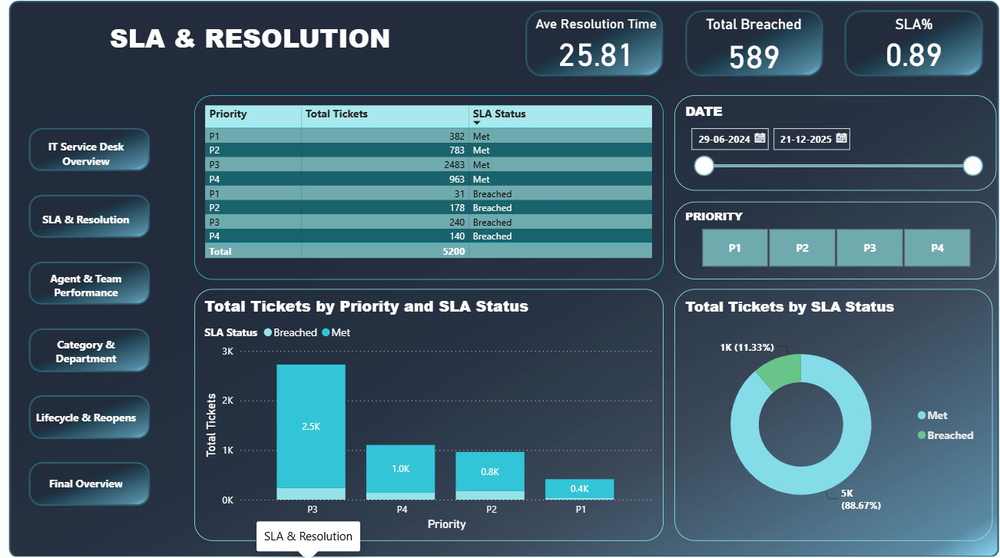
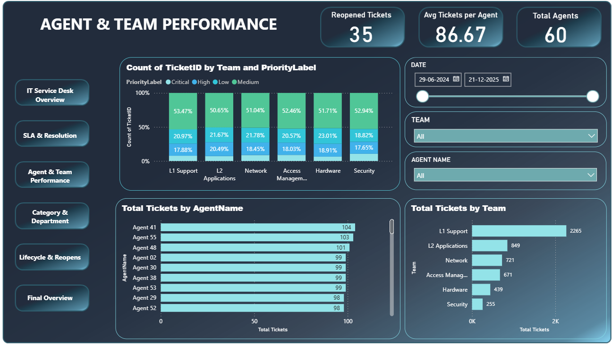
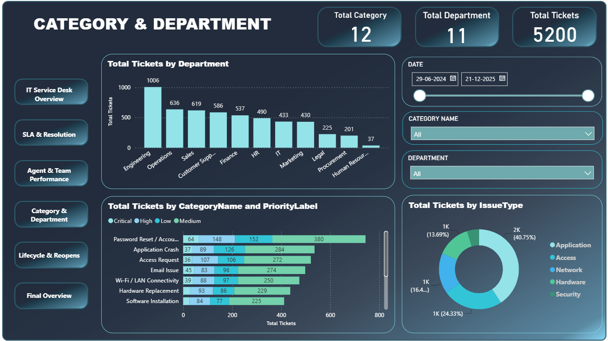
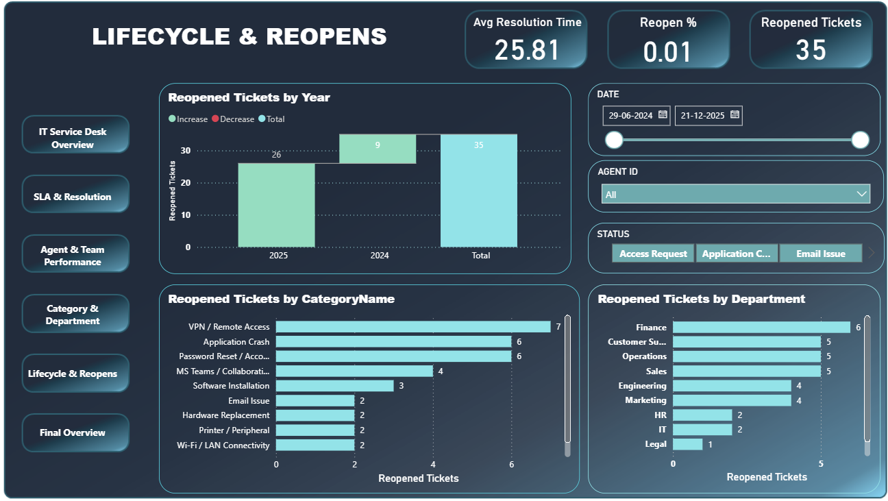
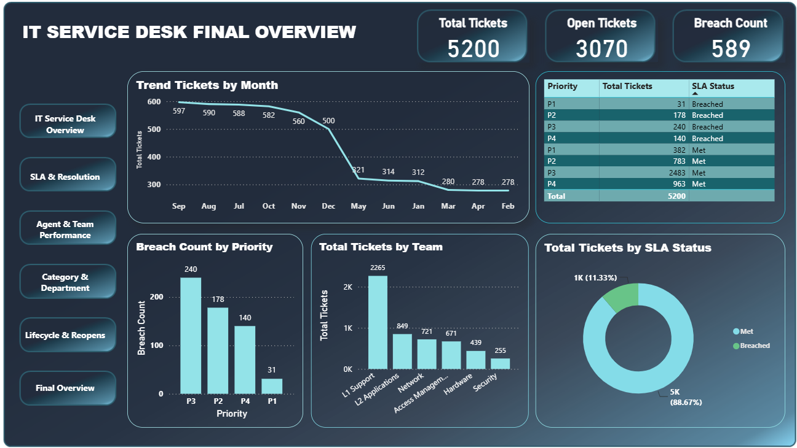

# IT Service Desk Analytics Dashboard

## Overview

This Power BI project provides a comprehensive analysis of IT Service Desk operations, helping organizations monitor ticket performance, SLA compliance, support efficiency, and agent productivity.

## Dataset

The dashboard uses the following datasets:

- Tickets.csv
- Ticket_History.csv
- Agents.csv
- Categories.csv
- SLA_Definitions.csv

## Key Metrics

- Total Tickets
- Open vs Closed Tickets
- SLA Compliance Rate
- Average First Response Time
- Resolution Performance
- Reopened Tickets
- Priority Distribution
- Category Analysis
- Department-wise Ticket Trends
- Agent Performance Tracking

## Dashboard Features

### Ticket Analytics
- Total tickets raised
- Monthly ticket trends
- Status distribution

### SLA Monitoring
- SLA compliance percentage
- Breached tickets analysis
- Priority-wise SLA tracking

### Category Insights
- Top issue categories
- Most frequent incidents
- Category trend analysis

### Agent Performance
- Tickets handled per agent
- Resolution efficiency
- Team-wise performance

## Tools & Technologies

- Power BI Desktop
- Power Query
- DAX
- CSV Data Sources

## Data Model

Relationships are established between:

- Tickets ↔ Agents
- Tickets ↔ Categories
- Tickets ↔ SLA Definitions
- Tickets ↔ Ticket History

## Business Benefits

- Improve service desk efficiency
- Track SLA compliance
- Identify recurring issues
- Measure support team productivity
- Support data-driven decision making

- ## Dashboard Preview

### IT Service Desk Overview

### SLA & Resolution

### Agent & Team Performance

### Category & Department Analysis

### Lifecycle & Reopens

### Final Executive Dashboard

## Author

Santhosh
